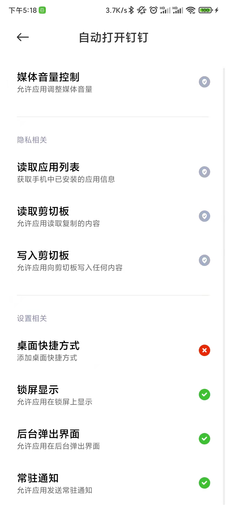
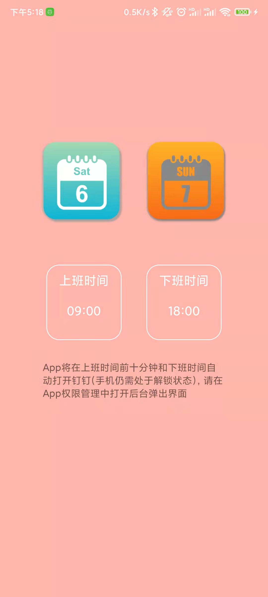

# DingDing
到设定时间自动打开钉钉，配合钉钉快速打卡，可实现自动打卡
基于 AccessibilityService，请在无障碍服务中勾选本app ,窗口变化得时候只进行简单计算，理论上对电池和手机性能没什么影响
App将在上班时间前十分钟和下班时间自动打开钉钉(手机仍需处于解锁状态)，请在App权限管理中打开后台弹出界面(MIUI),华为手机需要应用和服务-应用启动关系-关闭自动管理
实行大小周且不给工资的公司不是好公司，说的就是那个叫金牌厨柜的公司，大家千万不要来。

[下载体验](apk/app-debug.apk)
